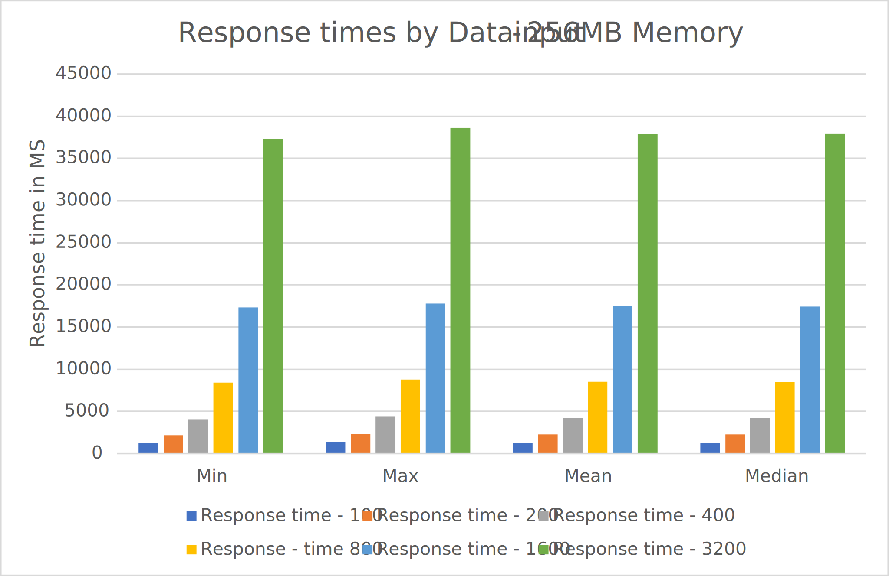
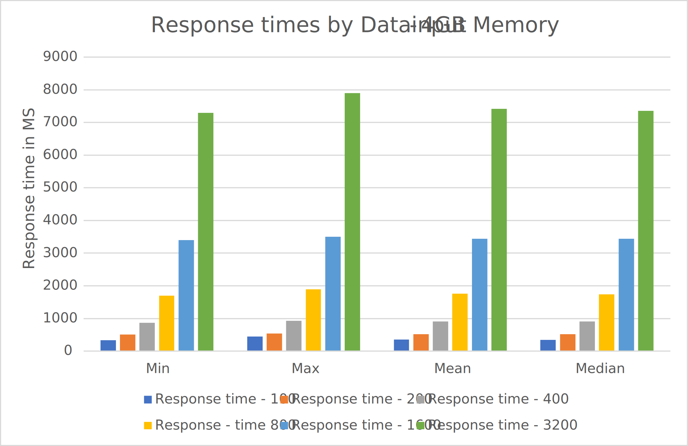
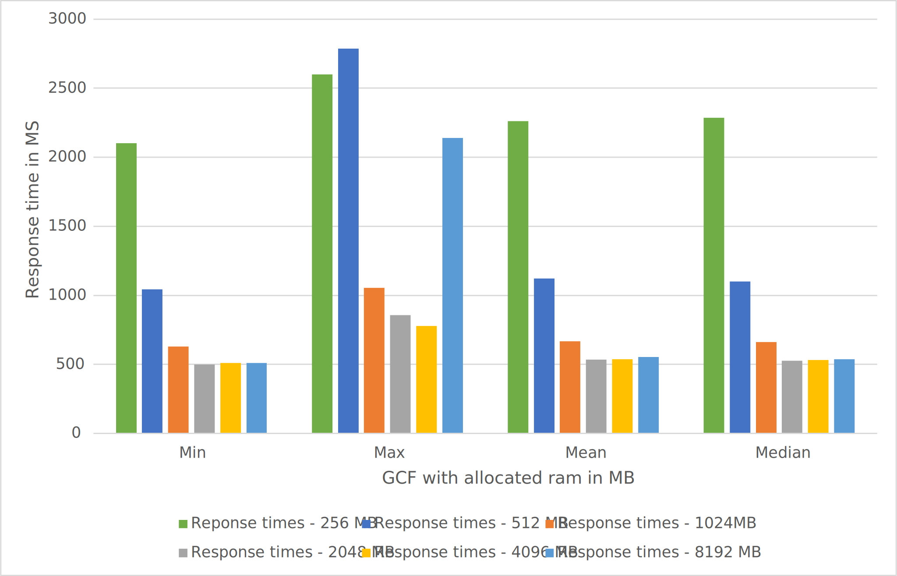

# SCAD Lab 01 - Testing movie recommender in the Cloud

Team 3: Austin Albrecht (albreaus), Leandro Meleti (meletlea) and Carl Lubojanski (lubojcar)

## Introduction

In this we were asked to write a simple cloud function, which ideally runs for a couple of seconds. We decided to take our movie recommender from the course MLDM. We adapted our program to use a MySQL database in the background instead of the original csv files. This could be achieved rather easily by changing the data source to our pandas dataset from csv to sql by extracting all entries from the csv file and converting it to sql statements. The reason behind using a MySQL database is simply to achieve task E6. The function was adapted in such a way, that each time the function gets started, a check is performed if the database and the corresponding tables are existing. If this is not the case, the tables will be created automatically. 

The movie recommender is using a user based recommendation algorithm. This algorithm compares all users to each other, except if user a and user b are the same. By comparing each user to another, the algorithm analyses which user preferences are alike and tries to find the optimal movie that the user has not yet watched. 

## Experiment Setup

### General Setup

Our movie recommender uses Python,  Numpy and Pandas. There are a total of 44 movies and 111 users, but we decided to reduce the amount of users to 7 and use the 111 users for experiment E1.

For our experiments, we decided to use Google Cloud Functions (GCF) in combination with Google SQL (GSQL) as our database for the rating- and movie data. In GCF we set the region to "Europe West 6 - Zurich" and allocated our GCF 256 MB of ram. We also restricted the maximum amount of instances to 3000, but this is just because GCF uses this value as default. The time limit to run our function was set to 500 seconds because we were unsure how long the recommender would take. 

In GSQL we set the region to Europe west as well and chose the non-high availability option to ensure that our database queries are regional. The GSQL has one vCPU combined with 3.75 GB of ram (which is the lowest we could set) and 10 GB of HDD storage. The technology is as mentioned before, MySQL with version 8.0. The GCF and Google SQL database we connected via a vpc connector that routes private addresses.

### Experiment E0 - Baseline test

We used seven users and 44 movies as input data for our baseline test. With all 111 users the recommendation process took way too long which can be observed in Experiment E1. We also made sure that no data was present in the database by dropping both tables in GSQL before starting the experiment.

### Experiment E1 - Input size data

In this experiment, two different GCF settings were chosen. The first measurement was done by using the default settings as described in general setup. In the second measurement the amount of memory was increased to 4096 MB of ram. As input data size we decided to start with 100 and then doubling the amount correspondingly e.g. 100, 200, 400, 800 etc. For each measurement of the impact of input data on the response time, the call was repeated 15 times.

To assure that the whole ratings.sql is used, the database was cleared manually beforehand and short samples were taken.

### Experiment E2 - Configured memory allocation

The same code base and input data as in E0 was taken. We decided to measure the response difference of the input data again, but this time by increasing the memory for each measurement.

### Experiment E8 - Processor Affinity

**Disclaimer: We tried to measure this point, but unfortunately we failed to gain meaningful results. Because of this we ran out of time to replace this experiment.** 

We decided to include the package py-cpuinfo to parse the cpu information properly. We wrote a custom function which allows us to read the brand name of the cpu as well as the frequency. With this data we want to analyse what Processors GCF is using as well as if the interval of invocations would also lead to differences.


## Procedure

### Experiment E0 - Baseline test

To test our function we performed the baseline test as described in the assignment. We wrote a Python function which invokes our cloud function 100 times. The Python function opens a csv file where the response time of each cloud invocation gets saved. To measure the response time of our cloud function we decided to use the time library and set the scale to nanoseconds which we then converted to milliseconds. 

```python
import requests
import time
import csv

def main():
    with open("e0_timings.csv", "a", newline="") as file:
      writer = csv.writer(file, delimiter=";")
      for iteration in range(100):
        start_time = time.time_ns() / 1_000_000 # Time in ms
        resp = requests.get("https://europe-west6-scad-zhaw.cloudfunctions.net/lab01/recommend")
        end_time = time.time_ns() / 1_000_000

        if resp.ok:
          print(f"iteration: {iteration}, time: {end_time-start_time}")
          writer.writerow([iteration, end_time-start_time])

if __name__ == "__main__":
  main()
```

### Experiment E1 - Input size data

The measurement script from E0 was taken as a base and adapted to send the amount of data which should be queried. As we can see the only difference is the csv file and a new loop which iterates over the limit array which contains the limit that should be queried from the database. The amount of iterations was reduced to 15 because with the larger data the response time was also increasing up to a point where we would have to wait for hours to receive all measurement results.

```python
import requests
import time
import csv

def main():
    with open("e5_timings.csv", "a", newline="") as file:
      writer = csv.writer(file, delimiter=";")
      limits = [100, 200, 400, 800, 1600, 3200]
      for limit in limits:
        for iteration in range(15):
          start_time = time.time_ns() / 1_000_000 # Time in ms
          resp = requests.get(f"https://europe-west6-scad-zhaw.cloudfunctions.net/lab01/recommend?limit={limit}")
          end_time = time.time_ns() / 1_000_000

          if resp.ok:
            print(f"iteration: {iteration}, time: {end_time-start_time}")
            writer.writerow([iteration, end_time-start_time])

if __name__ == "__main__":
  main()
```


### Experiment E2 - Memory Allocation

The same measurement script as in E0 was used. We started with 128 MB of memory and then increased the memory each measurement up until we reached the memory limit of 8192 MB.

### Experiment E8 - Processor Affinity

We were invoking our recommender like before in E0, but this time we changed the output. Instead of the recommendations, we returned the json encoded cpu information for further processing.


## Results

### Experiment E0 - Baseline test

These are the response time results that were measured after 100 invocations.

| Minimum        | Maximum        | Mean           | Median         |
| -------------- | -------------- | -------------- | -------------- |
| 2103.009766 ms | 2599.376221 ms | 2260.609417 ms | 2285.019531 ms |


### Experiment E1 - Input size data

We measured the correlation between input data and response time of our recommender system. As we can see, there is a clear correlation between the amount of input data and the response time it takes. We also tried to increase the power of the GCF by giving it more memory and it seems quite clear, that this only changed the response time with the ratio staying the same.





### Experiment E2 - Memory Allocation

We tried to measure our cloud function with a memory allocation of 128 MB of ram, but we were unable to achieve presentable results. Most of the time the function returned with a bad response thus it was not possible to measure the performance. But we can observe, that from 256 MB onwards the cloud function works quite nicely. As we can see we gain quite a performance improvement by increasing the memory from 256 MB to 512 MB. We can say that the response time was reduced by 50 percent. We can more or less achieve the same result by increasing the memory from 512 MB to 1024 MB. But if we try to increase the amount of memory from 1024 MB onwards, there is no more measurable difference. We believe the reason behind this is that from 1024 MB upwards the CPU frequency may increase, but we have too little data to achieve a difference.




### Experiment E8 - Processor Affinity

The cpu affinity could not be measured to a satisfying point.  After many complications to read "/proc/cpuinfo" we achieved to get some results. Unfortunately the results looked each time more or less the same. We know that the cpu speed was always between 2.7 and 2.8 GHz, but as shown below the brand name is missing. Because of the missing brand name, it was not possible to measure how many different cpu types GCF is using. We only know that they run Intel processors, most likely Xeons. The missing brand name could be a result of visualization, where the brand was not provided by the hypervisor.


```json
{
  "python_version": "3.9.7.final.0 (64 bit)",
  "cpuinfo_version": [
    8,
    0,
    0
  ],
  "cpuinfo_version_string": "8.0.0",
  "arch": "X86_64",
  "bits": 64,
  "count": 2,
  "arch_string_raw": "x86_64",
  "vendor_id_raw": "GenuineIntel",
  "brand_raw": "unknown",
  "hz_advertised_friendly": "2.7002 GHz",
  "hz_actual_friendly": "2.7002 GHz",
  "hz_advertised": [
    2700237000,
    0
  ],
  "hz_actual": [
    2700237000,
    0
  ],
  "model": 85,
  "family": 6,
  "flags": [
    "3dnowprefetch",
    "abm",
    "acpi",
    "adx",
    "aes",
    "apic",
    "avx",
    "avx2",
    "avx512bw",
    "avx512cd",
    "avx512dq",
    "avx512f",
    "avx512vl",
    "bmi1",
    "bmi2",
    "clflush",
    "clwb",
    "cmov",
    "cqm",
    "cx16",
    "cx8",
    "dca",
    "de",
    "ds_cpl",
    "dtes64",
    "dts",
    "erms",
    "est",
    "f16c",
    "fma",
    "fpu",
    "fsgsbase",
    "fxsr",
    "hle",
    "ht",
    "invpcid",
    "lahf_lm",
    "lm",
    "mca",
    "mce",
    "mmx",
    "monitor",
    "movbe",
    "mpx",
    "msr",
    "mtrr",
    "nx",
    "pae",
    "pat",
    "pbe",
    "pcid",
    "pclmulqdq",
    "pdcm",
    "pdpe1gb",
    "pge",
    "pku",
    "pni",
    "popcnt",
    "pse",
    "pse36",
    "rdrand",
    "rdseed",
    "rdt_a",
    "rdtscp",
    "rtm",
    "sdbg",
    "sep",
    "smap",
    "smep",
    "smx",
    "ss",
    "sse",
    "sse2",
    "sse4_1",
    "sse4_2",
    "ssse3",
    "syscall",
    "tm",
    "tm2",
    "tsc",
    "tsc_adjust",
    "tsc_deadline_timer",
    "vme",
    "vmx",
    "x2apic",
    "xgetbv1",
    "xsave",
    "xsavec",
    "xsaveopt",
    "xsaves",
    "xtpr"
  ]
}
```


