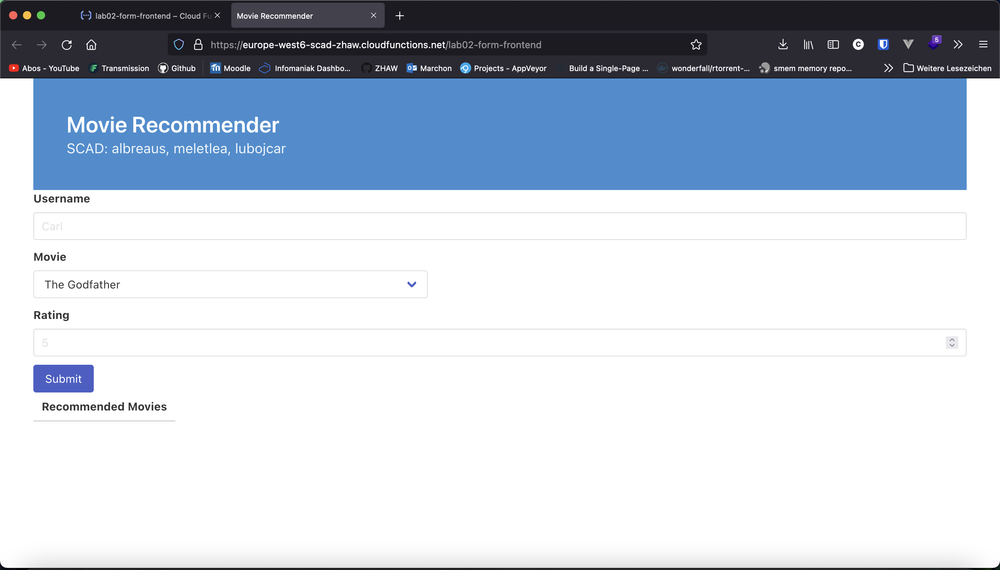
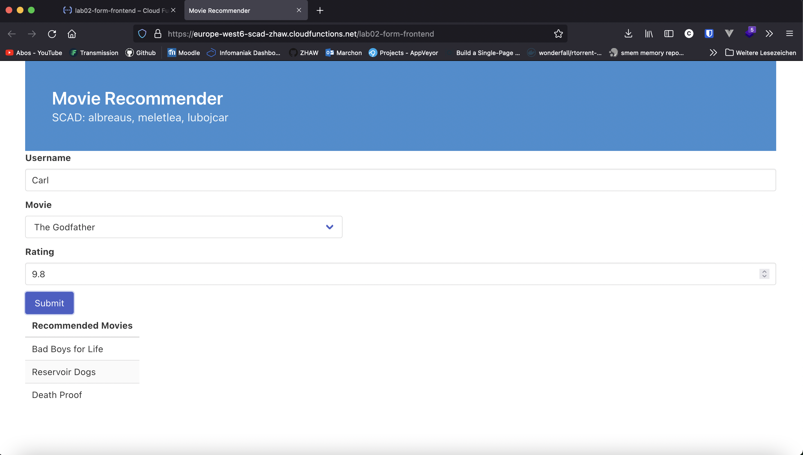
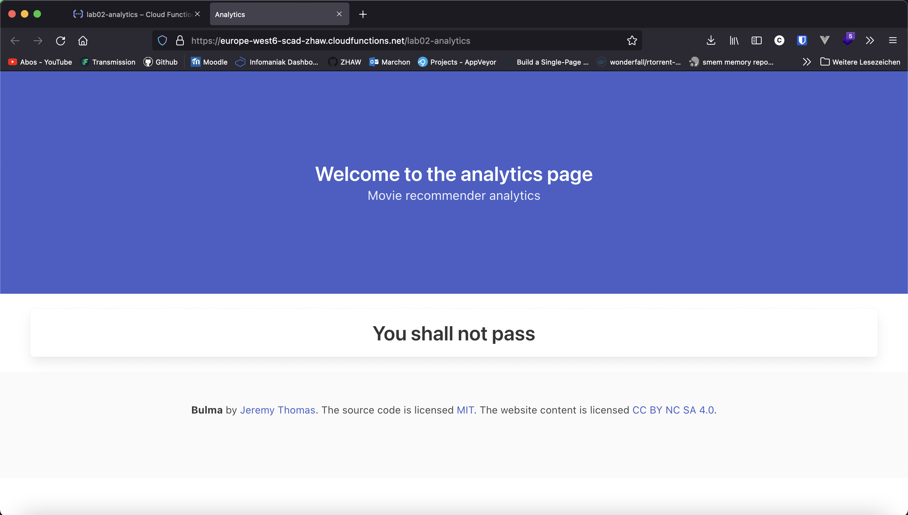
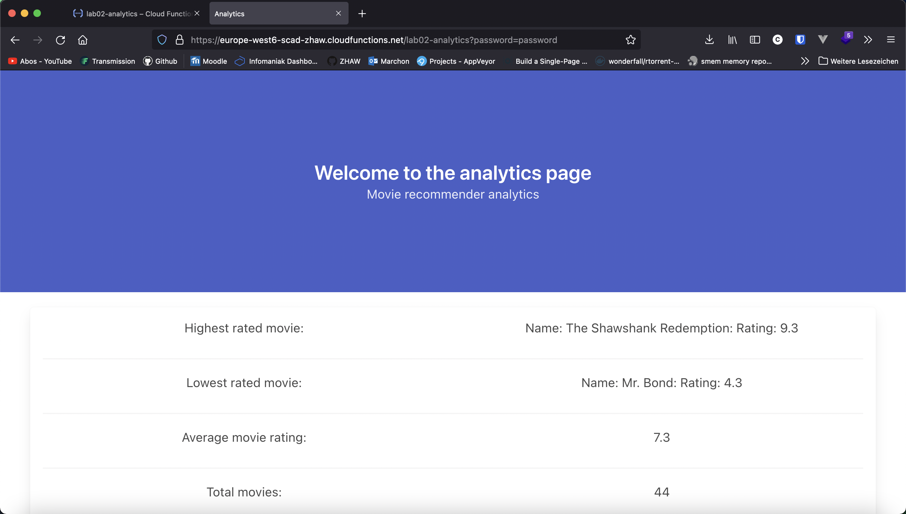

# Lab 02

## Introduction

We chose to implement our movie recommender system by choosing the polyglot path. In this lab there are three functions that were implemented. First, the backend which is essentially just a copy of the first lab. Second, the frontend which provides the user a interface to submit own movie ratings and receive individual recommendations  by the submitted ratings. Third there is a analytics tool which reads all the database entries and provides a variety of statistics.

The frontend uses NodeJs as technology, the backend uses Python and the analytics frontend uses Java. If you want to take a look at our code feel free to checkout the subfolders with matching function name.

## Frontend usage

If you want to try out our movie recommender, you just have to visit: [Frontend](https://europe-west6-scad-zhaw.cloudfunctions.net/lab02-form-frontend)

When you visit the frontend, the page is firstly asking you to provide it a movie rating in order to generate an appropriate movie recommendation. 

When we provide some data like in the image below, we receive a list of movies that match best to our previous movie rating. Of course, you can repeat this step over and over in order to get a better recommendation.

## Analytics usage

The analytics tool should provide a basic protection, so that authenticity can be assured. If you try to access the side without knowing the password you will be greeted by the following message:

If you try to visit the analytics page using our super secret password "password" the function will provide you the following data:

If you want to have a look by yourself, feel again free to checkout out the analytics page: [Analytics](https://europe-west6-scad-zhaw.cloudfunctions.net/lab02-analytics)