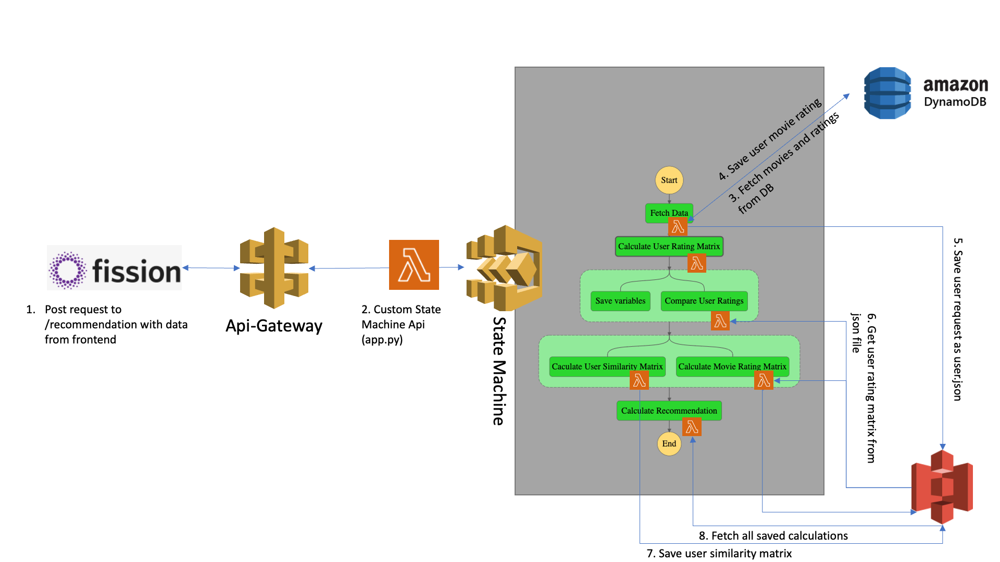

# Lab 04

## Installation

In order to use parts of this program locally, you need to create a 
virtualenv by executing the following command 
```python3 -m venv movie_recommender```. Followed by activating the virtualenv ```source ./movie_recommender/bin/source``` and installing the dependencies by executing ```pip3 install -r requirements.txt```. 

## Introduction

In this lab we decided to implement the requirement R1, R2 and R8.
Because of requirements R1 and R2 we had to use the AWS services from Amazon instead
of Google Cloud Functions. This was quite a challenge for us, because nobody in our
group has ever worked with AWS services before. The biggest three issues were the
quirks of DynamoDB, the permission system IAM and the maximum output size in the state machine.

## Architecture

Our architecture is unfortunately pretty complicated.
This diagram is simplified and covers not every detail.
It is only to show which technologies were used.

 

## Implementation

### R1 - Deployment Framework

We decided to use Zappa as our deployment framework. Zappa fits our needs perfectly, because our recommender is written entirely in Python. The usage of Zappa
was fairly straight forward. We started by deploying our api. Later on in the project we had to provide more information to zappa because we encountered cors and
permission violations. But after fiddeling with the settings and reading a couple of documentations we achieved our goal to deploy the api fully automatically. 

### R2 - Workflow

As Workflow engine we used AWS Step Functions. Inside the step functions we declared a new state machine. Afterwards we began to split up our recommender system in to multiple 
small microservices. Each microservice takes a json input and outputs its result in json as well. There were some complications during this microservice split up process. 
Some of our microservice functions generated output that is simply too large to pass it on as result. So we had to use a little trick and store some of the data inside a s3 bucket. Eventually we were able to successfully replicate our original recommender system by using only microservices. The following image shows the setup.

To deploy our microservices efficiently we decided to abuse zappa and add our microservices as deployment stages. The naming scheme might be quite confusing because every stage is named testX where x stands for an integer that was increased by one for each stage. We had quite a hard time to get the step functions working correctly. 
Therefore we used test functions but never actually changed the naming scheme.

But nevertheless we managed to make it fully funtional and our frontend can now send
a json post request like: ```{"movieID": "1234", "user":"abby", "rating": 6}``` to the state machine and receives an executionArn. This executionArn can then be polled via an api endpoint. When the state machine completes the result will be returned. More about that in R8.


### R8 - Private FaaS

#### Setting up Fission

The frontend of our movie recommender was deployed using [Fission](https://fission.io/) on the zhaw cloudlab and is available at [fission.neat.moe/movie](https://fission.neat.moe/movie).

This required running our own Kubernetes cluster as fission is based upon kubernetes. To do this we setup [Kind](https://kind.sigs.k8s.io/) which is a Kubernetes cluster that can be easily run on a single machine using Docker. 

In addition Kind also had to be configured to use [Metallb](https://kind.sigs.k8s.io/docs/user/loadbalancer/) in order for the cluster to be able to provide the LoadBalancer functionality required by fission. 

Installing fission was then relatively straighforward and simply required following the installation guide. Additionally a [Cloudflare tunnel](https://developers.cloudflare.com/cloudflare-one/connections/connect-apps) was setup in order to expose the service to the public without needing the zhaw vpn.

#### Setting up a function in Fission

- First we had to configure an environment for the function to run in using `fission environment create --name node --image fission/node-env --builder fission/node-builder`.
- Then the function could be deployed using the created environment `fission fn create --name movie --code movie.js --env nodejs`
- And lastly a route had to be setup in order for the function to be callable from the outside world `fission route create --function movie --url /movie --name movie`

#### Overall results

The setup for fission took quite a bit of research as well as trial and error to get everything up and running. However now that it's functional deploying new functions is very quick and easy.
