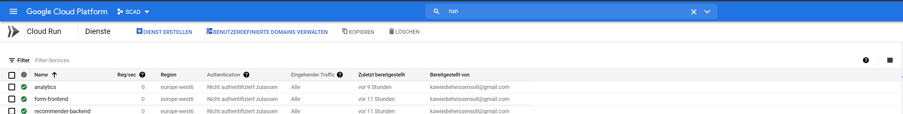
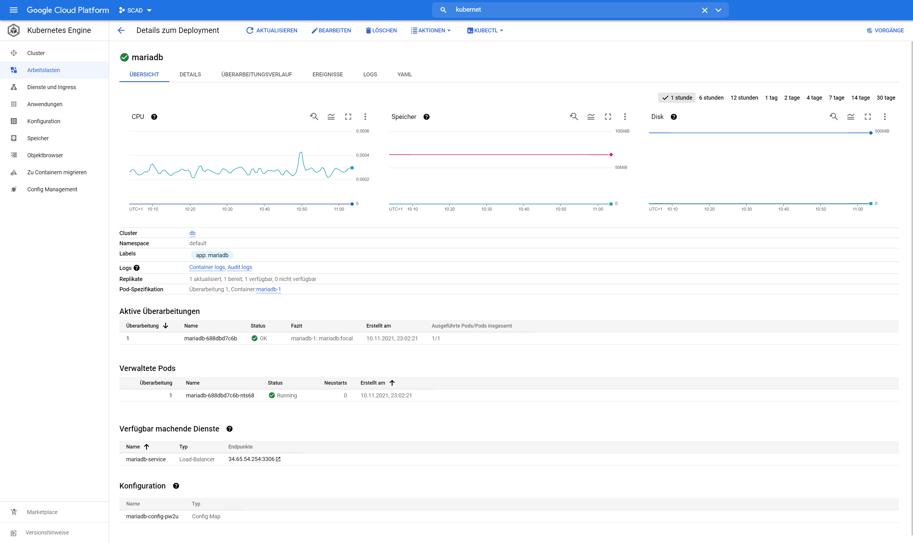

# Lab 05

## Introduction

In this lab the task was given to extend our base application with two long running and one short running containers. We decided it would be quite interesting to take our movie recommender script and put it into the short running docker container. This is the perfect use case for this application because it does not have to run around the clock. We also ported the form frontend of the recommender system as well as the analytics page. As long running container we chose a mariadb container because we need our data to be stored stateful. 

We consider this application to be a polyglot like in lab 02 with some cloud native parts in it.

## Setup

The whole project can be run locally. To try it out you have to clone this repository. After that you must provide a .env file in the root of the lab05 folder. In this .env file you have to define the following variables:

```bash
#.env
DB_NAME= #Name of the database that should be created
DB_USER= #Name of the user that should be granted access to the database
DB_PASS= #Password for the user
```

After creating the .env file and providing the necessary information you just have to open a terminal in the lab05 folder and run the command: docker-compose up to start the project. After starting the project you can visit localhost:8081/recommender to fill the database with sample SQL data. Now you are ready to visit either the frontend: localhost:8082 or the analytics page: localhost:8083?password=password.

If you want to exit the application just hit CTRL+C in the terminal where docker compose is running.

## Environment

We chose to host our applications on google cloud again as we did in all the other labs except lab04, because google has a way easier interface and permission system compared to Amazon AWS. 

For the short running containers we used Google Cloud Run [Figure 1].




Figure 1


For the long running containers we used Google Kubernetes Engine [Figure 2].



Figure 2


## Live instance

Feel free to try out our application under: 

- [Recommender frontend](https://form-frontend-wavwpzrrpq-oa.a.run.app) Frontend page to submit a recommendation.
- [Analytics frontend](https://analytics-wavwpzrrpq-oa.a.run.app?password=password) Analytics page to get some stats of our recommender system.

Please be aware of a little problem with the load balancer service. If you cannot choose a movie from the recommender frontend try to reload the page until the movie selection appears.

## Dockerhub

All containers can be fetched from the following sources:

- [Analytics page](https://hub.docker.com/r/carl503/analytics)
- [Recommender backend](https://hub.docker.com/r/carl503/recommender-backend)
- [Recommender frontend](https://hub.docker.com/r/carl503/form-frontend)

## Problems

Unfortunately, we were having some serious problems getting MariaDB running in the Kubernetes cluster. The main problem was, that we were not able to connect the Kubernetes cluster with the google cloud run instances. This is because you need some advanced routing with the Google VPC Connector. We tried to get the VPC Connector working, but failed. So we decided it would be tolerable if we make the Kubernetes pods public with a load balancer. But this introduced some new issues. Because three pods of MariaDB were running at the same time the whole project was extremely unstable. So we reduced the pods count from 3 to 1. This helped quite a lot with stability, but sometimes the load balancer still fails to forward the MariaDB pod. This was not fixable in time because no one has any experience with Kubernetes nor with load balancing.
