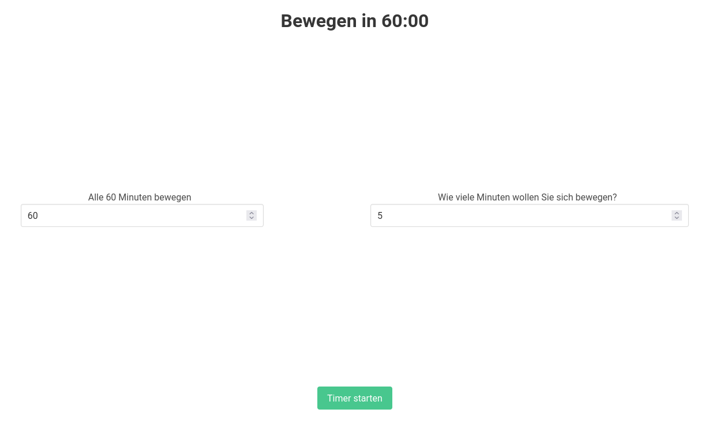
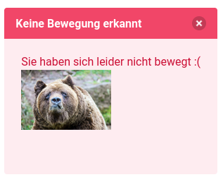
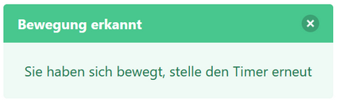

# Lab08

## Movy

For Lab 8 we had to create a serverless application using little bluetooth low-energy beacons.

Our application is called Movy and is a tool to help a user get more exercise by reminding them when to move as well as actually enforcing it. The user can choose an interval they want to be reminded to move as well as the duration. 

Right now the application is only supported on laptops or other devices that can be easily moved, but could be easily ported to other devices like smartphones.

## Flyer & Video

You can find the flyer [here](./flyer.pdf) and the video is available [here (TODO ADD LINK REMOVE THIS)](https://www.youtube.com/watch?v=dQw4w9WgXcQ)

## Usage

The frontend is very simplistic and used to configure the settings of the application as well as starting a timer.
On the left a number input is present in order to specify how long the application should wait until the user needs to move again.
On the right there is also a number input that allows the user to specify how long starting at the end of the timer they should move for.
At the bottom of the page there is a green button to start the timers. Pressing it starts the application.

If the user fails to move in the given timeframe then they will be notified accordingly:

The timer will also restart to give the user a chance to move after being notified.

If the user did move then they will also be notified:

## Technologies

### Client

The client is currently just a small python script that uses [bleak](https://pypi.org/project/bleak/) for bluetooth connectivity. In a non prototype version of this application a mobile app would substitute this python script and act as a client instead.

The client can be configured to use any number of bluetooth beacons and will poll their status every 5 seconds by default. The MAC address as well as the RSSI of the beacons in addition to a timestamp are all sent to the API where further processing can be done in a serverless manner.

### API

The Movy api is a node application using [express.js](https://expressjs.com/) and [MongoDB](https://www.mongodb.com/). It runs as a container on [Google Cloud Run](https://cloud.google.com/run/). For MongoDB we use the free tier of [MongoDB Atlas](https://www.mongodb.com/atlas), however this could easily be changed to use any other MongoDB host whether it be selfhosted or managed.

The client script submits data to the API using the `/data` endpoints which then simply store the data in MongoDB to be further processed.

In order for the frontend to detect if the user has moved or not the api provides a `/move` endpoints. This returns either `true` or `false` depending on if the user is considered to have moved in the duration they were supposed to. Movement is detected by averaging out the signal strengths of the beacons in the given timeframes, comparing them and then checking to see if they deviate more than a given percentage *(by default 15%)*.

### Frontend

The frontend is a [Vue v3](https://v3.vuejs.org/) single page application. It uses [axios](https://axios-http.com/) to transfer data to mentioned movy api and [Bulma](https://bulma.io/) is used as css framework. The frontend is hosted on [GitHub Pages](https://github.zhaw.ch/pages/SCAD-lumeal/movy-frontend/dist/) and accessible to everyone *(However it is not very useful in isolation without the client, it is only hosted for preview purposes)*.

